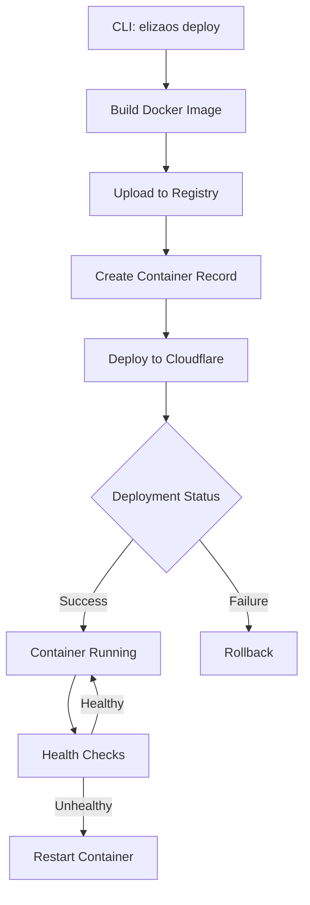

# ElizaOS Container Deployment

This document describes how to deploy ElizaOS projects to Cloudflare Containers using the `elizaos deploy` CLI command.

## Overview

The ElizaOS deployment system allows you to:

- Build Docker images locally
- Deploy ElizaOS agents to Cloudflare Containers
- Manage deployments through the web dashboard
- Scale containers automatically

## Prerequisites

1. **Docker**: Install Docker Desktop or Docker Engine
   - [Docker Desktop for Mac/Windows](https://www.docker.com/products/docker-desktop)
   - [Docker Engine for Linux](https://docs.docker.com/engine/install/)

2. **ElizaOS CLI**: Install the latest version

   ```bash
   npm install -g @elizaos/cli
   ```

3. **ElizaOS Cloud Account**:
   - Sign up at [eliza.cloud](https://eliza.cloud)
   - Create an API key in the dashboard under API Keys

4. **Cloudflare Configuration**:
   - The ElizaOS Cloud platform handles Cloudflare integration
   - No direct Cloudflare account needed

## Quick Start

### 1. Set up your API key

```bash
# Set your ElizaOS Cloud API key
export ELIZAOS_API_KEY="your-api-key-here"

# Optionally set custom API URL (default: https://eliza.cloud)
export ELIZAOS_API_URL="https://your-custom-instance.com"
```

### 2. Deploy your project

```bash
# From your ElizaOS project directory
cd my-eliza-project

# Deploy with default settings
elizaos deploy

# Or with custom options
elizaos deploy \
  --name my-agent \
  --port 3000 \
  --max-instances 3 \
  --env "NODE_ENV=production" \
  --env "OPENAI_API_KEY=sk-..."
```

### 3. Monitor deployment

The CLI will show deployment progress:

```
🚀 Starting ElizaOS deployment...
📦 Deploying project: my-agent
🔨 Building Docker image...
✅ Docker image built: elizaos/my-agent:latest
☁️  Deploying to Cloudflare Containers...
✅ Container created: abc-123-def-456
⏳ Waiting for deployment to complete...
Deployment status: building...
Deployment status: deploying...
Deployment status: running...
✅ Deployment successful!
📍 Container ID: abc-123-def-456
🌐 Worker ID: my-agent-worker
```

## CLI Options

### `elizaos deploy`

Deploy an ElizaOS project to Cloudflare Containers.

#### Options

| Option                        | Description                       | Default             |
| ----------------------------- | --------------------------------- | ------------------- |
| `-n, --name <name>`           | Name for the deployment           | Package name        |
| `-p, --port <port>`           | Port the container listens on     | 3000                |
| `-m, --max-instances <count>` | Maximum container instances       | 1                   |
| `-k, --api-key <key>`         | ElizaOS Cloud API key             | $ELIZAOS_API_KEY    |
| `-u, --api-url <url>`         | ElizaOS Cloud API URL             | https://eliza.cloud |
| `-d, --dockerfile <path>`     | Path to Dockerfile                | Dockerfile          |
| `-e, --env <KEY=VALUE>`       | Environment variable (repeatable) | -                   |
| `--no-build`                  | Skip Docker build step            | false               |
| `-t, --tag <tag>`             | Docker image tag                  | latest              |

#### Examples

**Basic deployment:**

```bash
elizaos deploy
```

**Custom name and port:**

```bash
elizaos deploy --name trading-bot --port 8080
```

**With environment variables:**

```bash
elizaos deploy \
  --env "OPENAI_API_KEY=sk-..." \
  --env "DATABASE_URL=postgresql://..." \
  --env "NODE_ENV=production"
```

**Multiple instances:**

```bash
elizaos deploy --max-instances 5
```

**Using existing Docker image:**

```bash
elizaos deploy --no-build --tag my-registry/my-agent:v1.2.3
```

## Dockerfile Configuration

### Default Dockerfile

If no Dockerfile exists, the CLI will generate a default one:

```dockerfile
FROM node:20-alpine

RUN apk add --no-cache python3 make g++

WORKDIR /app

COPY package*.json ./
COPY bun.lockb* ./

RUN npm install -g bun
RUN bun install --production

COPY . .
RUN bun run build || true

EXPOSE 3000

HEALTHCHECK --interval=30s --timeout=3s --start-period=40s --retries=3 \
  CMD node -e "require('http').get('http://localhost:3000/health', (r) => {if (r.statusCode !== 200) throw new Error('unhealthy')})"

CMD ["bun", "run", "start"]
```

### Custom Dockerfile

Create a `Dockerfile` in your project root:

```dockerfile
FROM node:20-alpine

WORKDIR /app

# Install dependencies
COPY package*.json ./
RUN npm install --production

# Copy application
COPY . .

# Build
RUN npm run build

# Expose port
EXPOSE 3000

# Health check endpoint
HEALTHCHECK CMD curl -f http://localhost:3000/health || exit 1

# Start application
CMD ["npm", "start"]
```

### Best Practices

1. **Multi-stage builds** for smaller images:

   ```dockerfile
   FROM node:20 AS builder
   WORKDIR /app
   COPY . .
   RUN npm install && npm run build

   FROM node:20-alpine
   WORKDIR /app
   COPY --from=builder /app/dist ./dist
   COPY --from=builder /app/node_modules ./node_modules
   CMD ["node", "dist/index.js"]
   ```

2. **Health checks** are required:

   ```dockerfile
   HEALTHCHECK --interval=30s --timeout=3s \
     CMD curl -f http://localhost:3000/health || exit 1
   ```

3. **Use .dockerignore**:
   ```
   node_modules
   .git
   .env
   *.log
   .DS_Store
   ```

## Managing Deployments

### Web Dashboard

View and manage containers at [eliza.cloud/dashboard/containers](https://eliza.cloud/dashboard/containers):

- **View all deployments**: See status, instances, and deployment dates
- **Delete containers**: Remove containers and stop billing
- **View logs**: Access container logs and errors
- **Monitor health**: Check health status and uptime

### API Management

Use the API for programmatic access:

```bash
# List all containers
curl -H "Authorization: Bearer $ELIZAOS_API_KEY" \
  https://eliza.cloud/api/v1/containers

# Get container details
curl -H "Authorization: Bearer $ELIZAOS_API_KEY" \
  https://eliza.cloud/api/v1/containers/{container-id}

# Delete container
curl -X DELETE \
  -H "Authorization: Bearer $ELIZAOS_API_KEY" \
  https://eliza.cloud/api/v1/containers/{container-id}
```

## Troubleshooting

### Docker build fails

**Problem**: Docker build error or timeout

**Solutions**:

- Ensure Docker is running: `docker info`
- Check Dockerfile syntax
- Verify dependencies are installable
- Use `--no-build` to skip build if image exists

### Deployment fails

**Problem**: Container status shows "failed"

**Solutions**:

- Check error message in dashboard
- Verify health check endpoint works locally
- Review environment variables
- Check port configuration matches your app

### Container not responding

**Problem**: Container deployed but not accessible

**Solutions**:

- Verify health check endpoint: `/health`
- Check application logs in dashboard
- Ensure port matches deployment config
- Verify environment variables are set correctly

### API authentication fails

**Problem**: "Invalid API key" error

**Solutions**:

- Verify API key is correct
- Check key hasn't expired
- Ensure key has proper permissions
- Generate new API key if needed

## Architecture

### Cloudflare Workers Integration

The deployment creates:

1. **Worker Script**: Proxy to container instances
2. **Container Binding**: Links worker to container
3. **Durable Object**: Manages container state
4. **Route**: Maps URL to worker

Example Worker configuration:

```javascript
export class ElizaContainer extends Container {
  defaultPort = 3000;
  sleepAfter = "10m";
}

export default {
  async fetch(request, env) {
    const sessionId =
      new URL(request.url).searchParams.get("sessionId") || "default";
    const containerInstance = getContainer(env.ELIZA_CONTAINER, sessionId);
    return containerInstance.fetch(request);
  },
};
```

### Container Lifecycle



## Environment Variables

### Required Variables

```bash
ELIZAOS_API_KEY=your-api-key-here
```

### Optional Variables

```bash
# Custom API URL
ELIZAOS_API_URL=https://your-instance.com

# Docker registry (if using custom registry)
DOCKER_REGISTRY=registry.example.com
DOCKER_USERNAME=username
DOCKER_PASSWORD=password
```

### Application Variables

Pass to deployed container via `--env` flag:

```bash
elizaos deploy \
  --env "OPENAI_API_KEY=sk-..." \
  --env "DATABASE_URL=postgresql://..." \
  --env "REDIS_URL=redis://..." \
  --env "NODE_ENV=production"
```

## Pricing

Containers are billed based on:

- **Compute time**: Per-second billing when running
- **Instance count**: Number of concurrent instances
- **Storage**: Image storage costs

See [pricing page](https://eliza.cloud/pricing) for details.

## Support

- **Documentation**: [docs.eliza.cloud](https://docs.eliza.cloud)
- **Community**: [Discord](https://discord.gg/elizaos)
- **Issues**: [GitHub](https://github.com/elizaos/eliza/issues)
- **Email**: support@eliza.cloud
