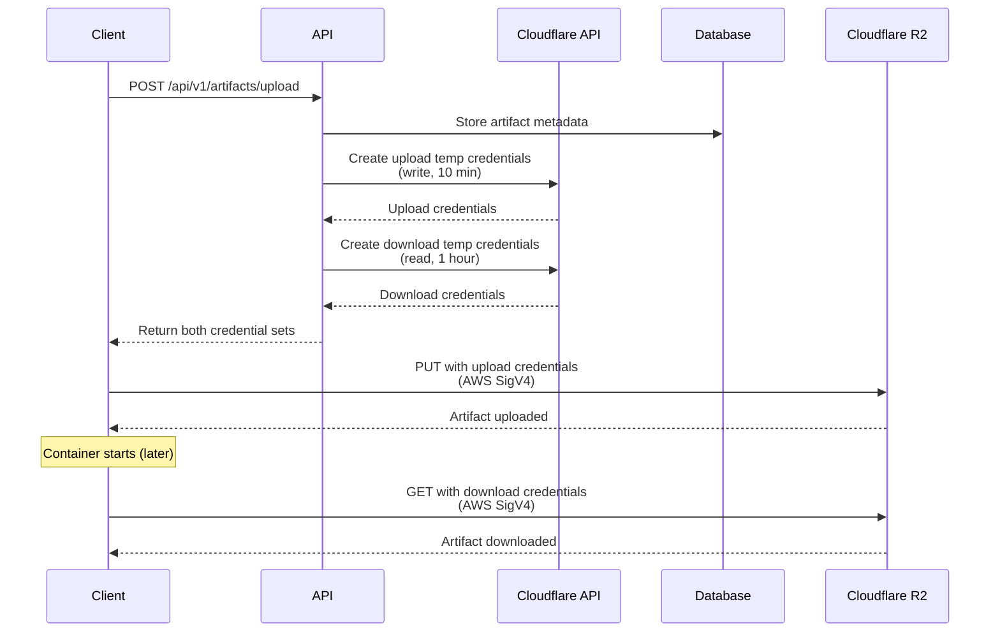

# Cloudflare R2 Temporary Credentials Implementation

## Overview

This implementation uses **Cloudflare's native temporary access credentials API** for R2 storage, providing secure, scoped, time-limited access to artifacts without custom token management.

## Why Cloudflare's Approach?

### Advantages

1. **No Custom Token Database**: No need for `artifact_tokens` table
2. **Industry Standard**: Uses AWS STS-compatible temporary credentials
3. **Better Security**: Managed by Cloudflare's infrastructure
4. **Granular Scoping**: Credentials limited to specific buckets/prefixes
5. **Time-Limited**: Built-in expiration (max 12 hours)
6. **Separate Permissions**: Different credentials for upload (write) vs download (read)

### How It Works



## API Flow

### 1. Request Artifact Upload

**POST** `/api/v1/artifacts/upload`

**Request:**

```json
{
  "projectId": "my-project",
  "version": "1.0.0",
  "checksum": "sha256:abc123...",
  "size": 1048576,
  "metadata": {
    "description": "Production build"
  }
}
```

**Response:**

```json
{
  "success": true,
  "data": {
    "artifactId": "abc123",
    "upload": {
      "url": "https://<account>.r2.cloudflarestorage.com/eliza-artifacts/artifacts/org/project/1.0.0/abc123.tar.gz",
      "method": "PUT",
      "accessKeyId": "R2_TEMP_ACCESS_KEY_ID",
      "secretAccessKey": "R2_TEMP_SECRET_ACCESS_KEY",
      "sessionToken": "R2_TEMP_SESSION_TOKEN",
      "expiresAt": "2025-10-12T10:10:00.000Z"
    },
    "download": {
      "url": "https://<account>.r2.cloudflarestorage.com/eliza-artifacts/artifacts/org/project/1.0.0/abc123.tar.gz",
      "method": "GET",
      "accessKeyId": "R2_TEMP_ACCESS_KEY_ID_2",
      "secretAccessKey": "R2_TEMP_SECRET_ACCESS_KEY_2",
      "sessionToken": "R2_TEMP_SESSION_TOKEN_2",
      "expiresAt": "2025-10-12T11:00:00.000Z"
    },
    "artifact": {
      "id": "abc123",
      "version": "1.0.0",
      "checksum": "sha256:abc123...",
      "size": 1048576
    }
  }
}
```

## Usage Examples

### CLI Upload with AWS SDK (Node.js)

```typescript
import {
  S3Client,
  PutObjectCommand,
  GetObjectCommand,
} from "@aws-sdk/client-s3";
import axios from "axios";
import fs from "fs";

async function uploadAndPrepareDownload() {
  // 1. Request artifact upload and get credentials
  const response = await axios.post(
    "https://api.elizacloud.ai/api/v1/artifacts/upload",
    {
      projectId: "my-project",
      version: "1.0.0",
      checksum: "sha256:abc123",
      size: fs.statSync("artifact.tar.gz").size,
    },
    {
      headers: {
        Authorization: `Bearer ${process.env.API_KEY}`,
      },
    },
  );

  const { upload, download } = response.data.data;

  // 2. Upload artifact using temporary credentials
  const uploadClient = new S3Client({
    region: "auto",
    endpoint: "https://<account>.r2.cloudflarestorage.com",
    credentials: {
      accessKeyId: upload.accessKeyId,
      secretAccessKey: upload.secretAccessKey,
      sessionToken: upload.sessionToken,
    },
  });

  const artifactData = fs.readFileSync("artifact.tar.gz");

  await uploadClient.send(
    new PutObjectCommand({
      Bucket: "eliza-artifacts",
      Key: new URL(upload.url).pathname.substring(1), // Extract key from URL
      Body: artifactData,
      ContentType: "application/gzip",
    }),
  );

  console.log("✓ Artifact uploaded");

  // 3. Return download credentials for container to use
  return {
    downloadUrl: download.url,
    credentials: {
      accessKeyId: download.accessKeyId,
      secretAccessKey: download.secretAccessKey,
      sessionToken: download.sessionToken,
    },
  };
}
```

### Container Bootstrap (Download)

```typescript
import { S3Client, GetObjectCommand } from "@aws-sdk/client-s3";
import { createWriteStream } from "fs";
import { pipeline } from "stream/promises";

async function bootstrapContainer(downloadInfo: any) {
  const { downloadUrl, credentials } = downloadInfo;

  // Create S3 client with temporary download credentials
  const client = new S3Client({
    region: "auto",
    endpoint: "https://<account>.r2.cloudflarestorage.com",
    credentials: {
      accessKeyId: credentials.accessKeyId,
      secretAccessKey: credentials.secretAccessKey,
      sessionToken: credentials.sessionToken,
    },
  });

  // Download artifact
  const command = new GetObjectCommand({
    Bucket: "eliza-artifacts",
    Key: new URL(downloadUrl).pathname.substring(1),
  });

  const response = await client.send(command);

  // Stream to file
  await pipeline(
    response.Body as NodeJS.ReadableStream,
    createWriteStream("artifact.tar.gz"),
  );

  console.log("✓ Artifact downloaded");

  // Extract and run
  // ... tar -xzf artifact.tar.gz
}
```

### Bash Script (AWS CLI)

```bash
#!/bin/bash

# 1. Request artifact upload
RESPONSE=$(curl -X POST https://api.elizacloud.ai/api/v1/artifacts/upload \
  -H "Authorization: Bearer $API_KEY" \
  -H "Content-Type: application/json" \
  -d '{
    "projectId": "my-project",
    "version": "1.0.0",
    "checksum": "sha256:abc123",
    "size": '$(stat -f%z artifact.tar.gz)'
  }')

# 2. Extract upload credentials
UPLOAD_URL=$(echo $RESPONSE | jq -r '.data.upload.url')
UPLOAD_ACCESS_KEY=$(echo $RESPONSE | jq -r '.data.upload.accessKeyId')
UPLOAD_SECRET=$(echo $RESPONSE | jq -r '.data.upload.secretAccessKey')
UPLOAD_TOKEN=$(echo $RESPONSE | jq -r '.data.upload.sessionToken')

# 3. Upload using AWS CLI with temporary credentials
AWS_ACCESS_KEY_ID=$UPLOAD_ACCESS_KEY \
AWS_SECRET_ACCESS_KEY=$UPLOAD_SECRET \
AWS_SESSION_TOKEN=$UPLOAD_TOKEN \
aws s3 cp artifact.tar.gz "s3://eliza-artifacts/$(echo $UPLOAD_URL | sed 's/.*eliza-artifacts\///')" \
  --endpoint-url https://<account>.r2.cloudflarestorage.com

# 4. Save download credentials for container
echo $RESPONSE | jq '.data.download' > download-credentials.json

# 5. Later, in container: Download using download credentials
DOWNLOAD_URL=$(cat download-credentials.json | jq -r '.url')
DOWNLOAD_ACCESS_KEY=$(cat download-credentials.json | jq -r '.accessKeyId')
DOWNLOAD_SECRET=$(cat download-credentials.json | jq -r '.secretAccessKey')
DOWNLOAD_TOKEN=$(cat download-credentials.json | jq -r '.sessionToken')

AWS_ACCESS_KEY_ID=$DOWNLOAD_ACCESS_KEY \
AWS_SECRET_ACCESS_KEY=$DOWNLOAD_SECRET \
AWS_SESSION_TOKEN=$DOWNLOAD_TOKEN \
aws s3 cp "s3://eliza-artifacts/$(echo $DOWNLOAD_URL | sed 's/.*eliza-artifacts\///')" artifact.tar.gz \
  --endpoint-url https://<account>.r2.cloudflarestorage.com
```

## Security Model

### Credential Scoping

**Upload Credentials:**

- Permission: `ObjectWrite` (write-only)
- Scope: Single object path (e.g., `artifacts/org/project/1.0.0/abc123.tar.gz`)
- Duration: 10 minutes
- Cannot read, only write

**Download Credentials:**

- Permission: `ObjectRead` (read-only)
- Scope: Single object path (same as above)
- Duration: 1 hour (allows time for container startup)
- Cannot write, only read

### Validation by Cloudflare

- Credentials validated by Cloudflare R2
- Expired credentials automatically rejected
- Scope enforced at R2 level
- No database lookups needed

## Environment Variables

Required for Cloudflare API access:

```bash
# Cloudflare Account
R2_ACCOUNT_ID=your_account_id

# Cloudflare API Authentication (choose one)
# Option 1: API Token (recommended)
CLOUDFLARE_API_TOKEN=your_api_token

# Option 2: Global API Key
CLOUDFLARE_EMAIL=your@email.com
CLOUDFLARE_API_KEY=your_global_api_key

# R2 Configuration
R2_BUCKET_NAME=eliza-artifacts
R2_ENDPOINT=https://<account>.r2.cloudflarestorage.com

# Parent R2 Credentials (for creating temp credentials)
R2_ACCESS_KEY_ID=your_r2_access_key
R2_SECRET_ACCESS_KEY=your_r2_secret_key
```

## Cloudflare API Reference

### Create Temporary Credentials

**Endpoint:**

```
POST https://api.cloudflare.com/client/v4/accounts/{account_id}/r2/temp-access-credentials
```

**Request Body:**

```json
{
  "bucket": "eliza-artifacts",
  "prefix": "artifacts/org/project/1.0.0/abc123",
  "permission": "ObjectRead",
  "ttl_seconds": 3600
}
```

**Response:**

```json
{
  "success": true,
  "result": {
    "accessKeyId": "R2_TEMP_...",
    "secretAccessKey": "...",
    "sessionToken": "..."
  }
}
```

### Permissions

| Permission        | Access Level          |
| ----------------- | --------------------- |
| `ObjectRead`      | Read and list objects |
| `ObjectWrite`     | Write objects         |
| `ObjectReadWrite` | Both read and write   |

### Constraints

- **Max TTL**: 43,200 seconds (12 hours)
- **Default TTL**: 3,600 seconds (1 hour)
- **Scope**: Must specify bucket, optional prefix
- **Parent Credentials**: Temp credentials cannot exceed parent permissions

## Migration from Custom Tokens

### Files to Remove

- ❌ `db/schema/artifact-tokens.ts`
- ❌ `lib/queries/artifact-tokens.ts`
- ❌ `app/api/v1/artifacts/[id]/download/route.ts`
- ❌ `app/api/v1/cron/cleanup-expired-tokens/route.ts`
- ❌ `db/migrations/0007_add_artifact_tokens_table.sql`
- ❌ `docs/ARTIFACT_TOKENS.md`

### Files to Update

- ✓ `app/api/v1/artifacts/upload/route.ts` (updated)
- ✓ `lib/services/r2-credentials.ts` (new)
- ✓ `db/sass/schema.ts` (remove artifactTokens table)

### Database Cleanup

```sql
-- Remove custom token table (no longer needed)
DROP TABLE IF EXISTS artifact_tokens;
```

## Testing

### Test Upload

```bash
# Get credentials
RESPONSE=$(curl -X POST http://localhost:3000/api/v1/artifacts/upload \
  -H "Authorization: Bearer $API_KEY" \
  -H "Content-Type: application/json" \
  -d '{"projectId":"test","version":"1.0.0","checksum":"sha256:abc","size":1024}')

echo $RESPONSE | jq '.data.upload'
```

### Test Download

```bash
# Use download credentials from above response
DOWNLOAD_ACCESS_KEY=$(echo $RESPONSE | jq -r '.data.download.accessKeyId')
DOWNLOAD_SECRET=$(echo $RESPONSE | jq -r '.data.download.secretAccessKey')
DOWNLOAD_TOKEN=$(echo $RESPONSE | jq -r '.data.download.sessionToken')

# Test access
AWS_ACCESS_KEY_ID=$DOWNLOAD_ACCESS_KEY \
AWS_SECRET_ACCESS_KEY=$DOWNLOAD_SECRET \
AWS_SESSION_TOKEN=$DOWNLOAD_TOKEN \
aws s3 ls s3://eliza-artifacts/artifacts/ \
  --endpoint-url https://<account>.r2.cloudflarestorage.com
```

## Troubleshooting

### "Invalid credentials"

- Check that `CLOUDFLARE_API_TOKEN` or `CLOUDFLARE_EMAIL`/`CLOUDFLARE_API_KEY` are set
- Verify token has R2 permissions
- Ensure account ID is correct

### "Permission denied"

- Parent R2 credentials must have permission to create temp credentials
- Check that the bucket name matches
- Verify prefix is correct

### "Expired credentials"

- Temporary credentials have short TTL (10 min for upload, 1 hour for download)
- Request new credentials if expired
- Consider increasing TTL for long-running operations

## Performance Benefits

- **No database queries** for token validation
- **No cleanup jobs** needed
- **Faster**: Direct R2 validation
- **Scalable**: Cloudflare handles all credential management
