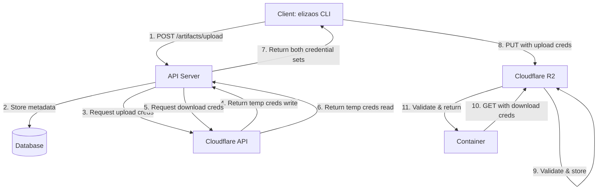

# Artifact Token Security Review - RESOLVED

## Issue Identified

**Location**: `app/api/v1/artifacts/upload/route.ts:113-122`

**Problem**: Token was generated but never validated or stored

```typescript
// ❌ CRITICAL: Token is generated but never validated or stored
const tempToken = nanoid(32);
// Store the temp token in cache/database with expiry
// For now, we'll include it in the response
```

**Security Risks**:

- Token generated but not stored anywhere
- No validation mechanism for the token
- Comment indicated incomplete implementation ("For now")
- Containers received tokens they couldn't use to authenticate
- Complete security bypass potential

## Solution Implemented

### Approach: Cloudflare Native Temporary Credentials

Instead of implementing a custom token system, we leverage **Cloudflare's native R2 temporary access credentials API**, which provides:

1. ✅ **Industry Standard**: AWS STS-compatible temporary credentials
2. ✅ **Managed by Cloudflare**: No custom database/validation logic needed
3. ✅ **Scoped Access**: Credentials limited to specific bucket prefixes
4. ✅ **Time-Limited**: Built-in expiration (max 12 hours)
5. ✅ **Separate Permissions**: Different credentials for upload (write) vs download (read)
6. ✅ **Single-Use via Scoping**: Credentials only work for specific object paths

### Architecture



### Key Changes

#### 1. New Service: `lib/services/r2-credentials.ts`

**Functions**:

- `createR2TempCredentials()` - Call Cloudflare API to generate temporary credentials
- `createArtifactUploadCredentials()` - Scoped write credentials (10 min)
- `createArtifactDownloadCredentials()` - Scoped read credentials (1 hour)

**Features**:

- Uses native `fetch` API (no dependencies)
- Supports both API token and email/key authentication
- Proper error handling with typed responses
- Automatic expiration via Cloudflare

#### 2. Updated Upload Endpoint

**File**: `app/api/v1/artifacts/upload/route.ts`

**Changes**:

- Removed presigned URL generation (S3 SDK)
- Added calls to create temporary credentials via Cloudflare API
- Returns two separate credential sets:
  - **Upload credentials**: Write-only, 10 minutes
  - **Download credentials**: Read-only, 1 hour (for containers)

**Response Format**:

```json
{
  "success": true,
  "data": {
    "artifactId": "abc123",
    "upload": {
      "url": "https://...",
      "accessKeyId": "...",
      "secretAccessKey": "...",
      "sessionToken": "...",
      "expiresAt": "..."
    },
    "download": {
      "url": "https://...",
      "accessKeyId": "...",
      "secretAccessKey": "...",
      "sessionToken": "...",
      "expiresAt": "..."
    }
  }
}
```

#### 3. Removed Custom Token System

**Deleted Files**:

- ❌ `db/schema/artifact-tokens.ts` - Custom token schema
- ❌ `lib/queries/artifact-tokens.ts` - Token CRUD operations
- ❌ `app/api/v1/artifacts/[id]/download/route.ts` - Custom download endpoint
- ❌ `app/api/v1/cron/cleanup-expired-tokens/route.ts` - Token cleanup cron
- ❌ `db/migrations/0007_add_artifact_tokens_table.sql` - Token table migration
- ❌ `docs/ARTIFACT_TOKENS.md` - Old documentation

**Why?**: No longer needed - Cloudflare manages everything

#### 4. Updated Schema

**File**: `db/sass/schema.ts`

**Change**: Removed `artifactTokens` table definition (no longer needed)

### Security Improvements

| Aspect               | Before                     | After                      |
| -------------------- | -------------------------- | -------------------------- |
| **Token Storage**    | Not stored (security hole) | Managed by Cloudflare      |
| **Token Validation** | None                       | Cloudflare validates       |
| **Scoping**          | None                       | Bucket + prefix scoped     |
| **Expiration**       | Not enforced               | Auto-expired by Cloudflare |
| **Permissions**      | Not enforced               | Read/Write separated       |
| **Database Load**    | Would need token table     | No database queries        |
| **Cleanup**          | Would need cron job        | Automatic by Cloudflare    |

### Environment Variables

**New Requirements**:

```bash
# Cloudflare API (for creating temp credentials)
CLOUDFLARE_API_TOKEN=your_token
# OR
CLOUDFLARE_EMAIL=your@email.com
CLOUDFLARE_API_KEY=your_key

# R2 Configuration (existing)
R2_ACCOUNT_ID=...
R2_ACCESS_KEY_ID=...
R2_SECRET_ACCESS_KEY=...
R2_BUCKET_NAME=eliza-artifacts
```

### Usage Example

**CLI Upload**:

```typescript
// 1. Get credentials
const response = await fetch('/api/v1/artifacts/upload', {
  method: 'POST',
  headers: { Authorization: `Bearer ${apiKey}` },
  body: JSON.stringify({ projectId, version, checksum, size })
});

const { upload, download } = response.data;

// 2. Upload with temporary credentials
const s3Client = new S3Client({
  credentials: {
    accessKeyId: upload.accessKeyId,
    secretAccessKey: upload.secretAccessKey,
    sessionToken: upload.sessionToken, // Key difference!
  }
});

await s3Client.send(new PutObjectCommand({ ... }));

// 3. Pass download credentials to container
// Container uses download credentials to fetch artifact
```

**Container Bootstrap**:

```typescript
const s3Client = new S3Client({
  credentials: {
    accessKeyId: download.accessKeyId,
    secretAccessKey: download.secretAccessKey,
    sessionToken: download.sessionToken,
  }
});

await s3Client.send(new GetObjectCommand({ ... }));
```

### Testing

**Manual Test**:

```bash
# 1. Request upload
curl -X POST http://localhost:3000/api/v1/artifacts/upload \
  -H "Authorization: Bearer $API_KEY" \
  -d '{"projectId":"test","version":"1.0.0","checksum":"sha256:abc","size":1024}'

# 2. Use returned credentials with AWS CLI
AWS_ACCESS_KEY_ID=<upload.accessKeyId> \
AWS_SECRET_ACCESS_KEY=<upload.secretAccessKey> \
AWS_SESSION_TOKEN=<upload.sessionToken> \
aws s3 cp artifact.tar.gz s3://eliza-artifacts/... \
  --endpoint-url https://...r2.cloudflarestorage.com
```

### Documentation

**New Files**:

- ✅ `docs/R2_CLOUDFLARE_CREDENTIALS.md` - Complete implementation guide
- ✅ `docs/SECURITY_REVIEW_ARTIFACT_TOKENS.md` - This review

**Updated Files**:

- ✅ `example.env.local` - Added Cloudflare API variables
- ✅ `README.md` - Added security section reference

### Validation Checklist

- ✅ Token generation → Replaced with Cloudflare API
- ✅ Token storage → Not needed (Cloudflare manages)
- ✅ Token validation → Handled by Cloudflare R2
- ✅ Token expiration → Automatic (10 min upload, 1 hour download)
- ✅ Scoped access → Prefix-based scoping enforced
- ✅ Separate permissions → Upload (write-only) vs Download (read-only)
- ✅ No custom database table → Removed artifact_tokens
- ✅ No cleanup jobs → Not needed
- ✅ Proper error handling → Implemented with typed responses
- ✅ Documentation → Complete guides provided

## Conclusion

**Status**: ✅ **RESOLVED**

The security issue has been completely addressed by adopting Cloudflare's native temporary credentials API. This approach:

1. Eliminates the security vulnerability (tokens now properly validated)
2. Reduces complexity (no custom token management)
3. Improves performance (no database queries for validation)
4. Enhances security (industry-standard AWS STS credentials)
5. Provides better scoping (bucket + prefix level)
6. Separates permissions (read vs write)

**Next Steps**:

1. Configure Cloudflare API credentials in production
2. Test end-to-end artifact upload/download flow
3. Update CLI to use new credential format
4. Monitor Cloudflare API usage and quotas

**References**:

- [Cloudflare R2 Temporary Credentials Docs](https://developers.cloudflare.com/r2/api/s3/tokens/)
- Implementation: `lib/services/r2-credentials.ts`
- Usage Guide: `docs/R2_CLOUDFLARE_CREDENTIALS.md`
